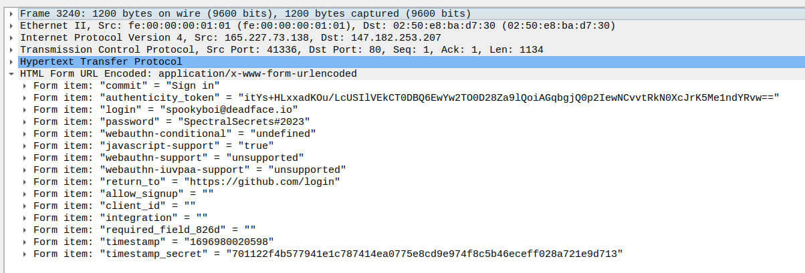

# Git REKT

## Description

:::note[Category]
traffic analysis
:::

One of our teammates at Turbo Tactical ran a phishing campaign on spookyboi and thinks spookyboi may have submitted credentials. We need you to take a look at the PCAP and see if you can find the credentials.

Submit the password as the flag: `flag{password}`.

[Attached file](resources/pcap-20231010.pcap)

## Solution

By using filter `http contains "spookyboi"` we see the only one HTTP packet.
Open and see:

## Flag

:::tip[Flag]
flag\{SpectralSecrets\#2023}
:::
